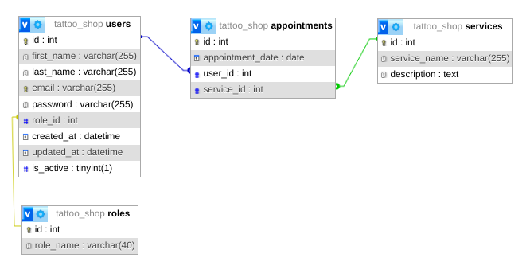

# Tattoo Studio Database Project

This project was made as part of a course Full Stack Developer for GeeksHubs Academy.

## Index 🔍

- [Assignment](#assignment-)
- [Deploy](#deploy)
- [Stack](#stack)
- [Database Diagram](#database-diagram)
- [Clone](#clone)
- [Endpoints](#endpoints)
- [Points of Improvement](#points-of-improvement)

## Assignment 📝

GeeksHub gave the following fictive assignment: The product department has tasked us with developing the backend
corresponding to the appointment management system for a tattoo studio.

**Appointment management for a tattoo studio**: Users will be able to register in the application, log in and access their personal area. Within their area, they will be able to view a list of scheduled appointments for tattoo and piercing services, as well as create new appointments for various services offered by the studio.

## Deploy 💫

Deploy via Zeabur: [ghtattooshop.zeabur.app](https://ghtattooshop.zeabur.app/) <br>
(This is a free version of Zeabur and can get suspended at any moment.)

## Stack 💻

<div align="center">
<a href="https://www.expressjs.com/">
    
</a>
<a href="https://nodejs.org/es/">
    
</a>
<a href="https://developer.mozilla.org/es/docs/Web/JavaScript">
    
</a>
<a href="">
    
</a>
<a href="">

</a>
<a href="">
    
</a>
<a href="">
    
</a>
 </div>

## Database Diagram 📊

This diagram shows the structure of the database tables.



## Local installation option 🛠️

1. Clone the repository from the url
2. `$ npm install`
3. Connect the cloned repo with our Database
4. `$ Execute the migrations`
5. `$ Execute the seeders`
6. `$ npm run dev` to elevate our server

## Endpoints ⚙️

<details>
<summary>Authentication</summary>

- AUTH

  - REGISTER

          POST http://localhost:4000/api/auth/register

    body:

    ```js
        {
            "email": "yourmail@mail.com",
            "password": "123456789"
        }
    ```

  - LOGIN

          POST http://localhost:4000/api/auth/login

    body:

    ```js
        {
            "email": "yourmail@mail.com",
            "password": "123456789"
        }
    ```

      </details>
      <details>

<summary>Users</summary>

- USERS

      - GET ALL USERS (ONLY FOR ADMINS)

              GET http://localhost:4000/api/users

          auth:
          ```
          your token

          ```

       - SHOW USER PROFILE

              GET http://localhost:4000/api/users/profile

          auth:
          ```
          your token

          ```

      - CHANGE PROFILE INFO

              PUT http://localhost:4000/api/users/profile/change

          auth:
          ```
          your token

          ```
          body:
          ``` js
              {
                  info you want to change goes here
              }
          ```

      - PROFILE FILTERED BY EMAIL

              GET http://localhost:4000/api/users/:email

          auth:
          ```
          your token
          ```
          body:
          ``` js
               {
                  "email": "the users email you want to find goes here"
               }
          ```

      - DELETE USER BY ID

              GET http://localhost:4000/api/users/:id

          auth:
          ```
          your token
          ```
          body:
          ``` js
               {
                  "id": "the ID of the user you want to delete goes here"
               }
          ```

</details>

<details>

<summary>Appointments</summary>

- APPOINTMENTS

      - CREATE APPOINTMENT

              POST http://localhost:4000/api/appointments/create

          auth:
          ```
          your token
          ```
          body:
          ``` js
              {
                  "appointment_date": "2024/01/01",
                  "service_id": 2
              }
          ```

      - CHANGE APPOINTMENT

              PUT http://localhost:4000/api/appointments/change

          auth:
          ```
          your token
          ```
          body:
          ``` js
              {
                  "id": your appointment id,
                  "infotochange": value
              }
          ```

          - FIND APPOINTMENT BY ID

              GET http://localhost:4000/api/appointments/:id

          auth:
          ```
          your token
          ```
          body:
          ``` js
              {
                  "id": 1
              }
          ```

          - SHOW USER APPOINTMENTS

              GET http://localhost:4000/api/appointments/scheduled

          auth:
          ```
          your token
          ```

          - DELETE APPOINTMENT

              DELETE http://localhost:4000/api/appointments/delete

          auth:
          ```
          your token
          ```
          body:
          ``` js
              {
                  "id": 1
              }
          ```

  </details>

<details>

<summary> Services </summary>

- SERVICES

  - CREATE SERVICE (only for admins)
    POST http://localhost:4000/api/services

        auth:
        ```
        your token
        ```
        body:
        ``` js
            {
                "service_name": "Name",
                "description": "blablabla.com"
            }
        ```

    - SEE ALL SERVICES

            GET http://localhost:4000/api/services

      auth:

      ```
      your token
      ```

    - UPDATE SERVICE (only for admins)

            PUT http://localhost:4000/api/services/:id

      auth:

      ```
      your token
      ```

      body:

      ```js
          {
              "id": 2,
              "description": "blablabla.com"
          }
      ```

    - DELETE SERVICE BY ID

           GET http://localhost:4000/api/services/:id

      auth:

      ```
      your token
      ```

      body:

      ```js
          {
              "id": 1
          }
      ```

  </details>

<details>

<summary> Roles </summary>

- ROLES

  - SEE ALL ROLES (only for admins!)

            GET http://localhost:4000/api/roles

        auth:
        ```
        your token
        ```

  - CREATE ROLE (only for admins)
    POST http://localhost:4000/api/roles/create

        auth:
        ```
        your token
        ```
        body:
        ``` js
            {
                "id": 1,
                "name": "hokage"
            }
        ```

    - UPDATE ROLE (only for admins)

            PUT http://localhost:4000/api/roles/update/:id

      auth:

      ```
      your token
      ```

      body:

      ```js
          {
              "id": 2,
              "infotoupdate": "blablabla"
          }
      ```

    - DELETE ROLE

           DELETE http://localhost:4000/api/roles/delete

      auth:

      ```
      your token
      ```

      body:

      ```js
          {
              "name": superAdmin
          }
      ```

  </details>

## Points of Improvement 💡

Throughout the project you can find several "ToDo"-comments here and there. These are either thoughts I had myself for extra functionalities or extra options (but not requirements) to add as suggested by the original assignment.
